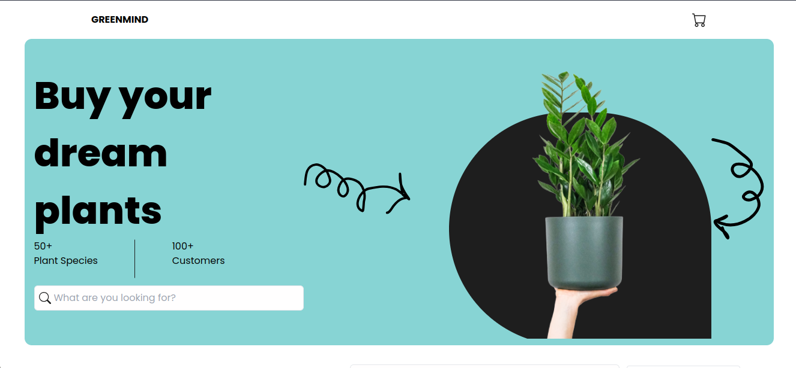

# GreenMind Shop

This is a simple React-based e-commerce application named GreenMind Shop. It allows users to browse products, search for specific items, and manage their shopping basket.

## Review

## Project Structure

The project structure is organized as follows:

- `src/`: Contains the source code of the application.
  - `components/`: Reusable UI components used throughout the app.
  - `constants/`: Contains constant data, such as product information.
  - `Pages/`: Each page of the application is organized in a separate directory.
    - `Basket/`: The shopping basket page.
  - `App.jsx`: The main component orchestrating the application.

## Tech Stack

- **React:** The core library for building user interfaces.
- **React Router:** For declarative routing within the application.
- **React Icons:** Provides a set of customizable icons for use in React projects.
- **Vite:** A fast build tool for modern web development.
- **Tailwind CSS:** A utility-first CSS framework for building responsive designs.
- **ESLint:** A tool for identifying and fixing code issues.

## Features

- Browse and search for products.
- Sort products by price in ascending or descending order.
- Add products to the shopping basket.
- View and manage items in the shopping basket.

Feel free to customize and extend this project according to your needs!
